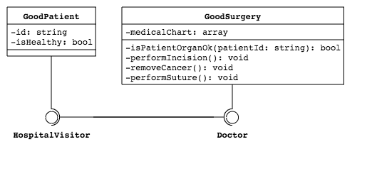

## Tell Don't Ask

デメテルの法則 [Law of Demeter](https://ja.wikipedia.org/wiki/%E3%83%87%E3%83%A1%E3%83%86%E3%83%AB%E3%81%AE%E6%B3%95%E5%89%87)


### 1. 悪いコード

ちょっと怖い例ですが、医者に大腸がんと診断され手術をするとういう例です。
極弾ではありますが、以下のコードを例えると
> 私の大腸を出してみてくださいし手術が必要かどうか私が確認して判断します。手術が必要になった場合あなたは手術をして大腸を私の体の中に戻してください。

大腸は患者内部の状態です。しかしこの例での患者は`$isHealthy: bool`状態だけを持っており、診断名は医者が持っている`$medicalChart: array`に格納されます。
つまり、`Surgery::isMyOrganOk(): bool`はPublic APIを呼び出し `Surgery::$medicalChart: array`の状態を判定します。そして `Surgery::doSurgery()` 関数を呼び出し`Surgery::$medicalChart: array`の状態を変更します。

```php
<?php // TellDontAsk/Bad/Patient.php

public function requestMedicalTreatment(Doctor $doctor): void
{
    if (false === $doctor->isMyOrganOk($this)) {
        $doctor->doSurgery($this);
    }
}
```
誰のせいでしょうか？他のクラスの状態を照会した患者クラスの誤りもありますが、自分の内部状態を`Surgery::isMyOrganOk(): bool`というPublic APIで公開した医者クラスの誤り方が大きいです。

この原則とは違う話ですが、クライアントのコードを組むときに`if`、` switch`を使う場合、デザインの原則に反するものではないか、もう一度考慮する必要があります。また、Public APIを設計する際に`bool`を返すこともDesign Smellです。クライアントコードで`if`テストをしてたくなる誘因を提供したからです。

```php
<?php // TellDontAsk/Bad/Surgery.php

public function isMyOrganOk(Patient $patient)
{
    $patientId = $patient->getId();

    if (array_key_exists($patientId, $this->medicalChart)) {
        return $this->medicalChart[$patientId]['healthiness'];
    }

    throw new Exception("チャートにない患者です: {$patientId}");
}
```


### 2. デザインの原則を守る

以下のコードでの医者オブジェクトは自身の内部状態を表わしていないし、患者も医師オブジェクトの状態を問いません。
単純に医師オブジェクトの状態を変更する `Surgery::doSurgery()`を呼び出しているだけです。

```php
<?php // TellDontAsk/Surgery.php

private function isPatientOrganOk(string $patientId)
{
    return $this->medicalChart[$patientId]['healthiness'];
}
```

```php
<?php // TellDontAsk/Patient.php

public function requestMedicalTreatment(Doctor $doctor): void
{
    $doctor->doSurgery($this);
}
```


